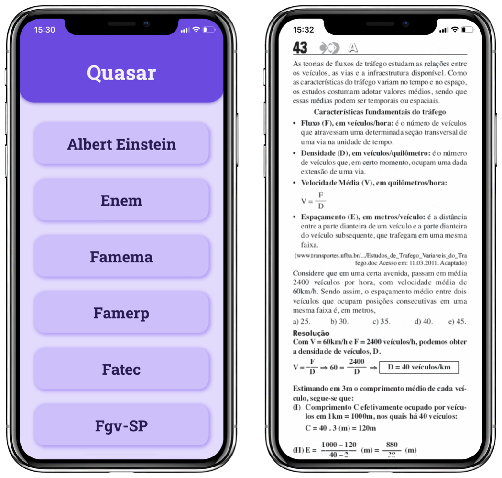

# Quasar — learn by absorbing

Quasar is an educational Progressive Web Application ([PWA](https://en.wikipedia.org/wiki/Progressive_web_app)) designed for Brazilian students to study for the country's main entrance exams based on the commented resolution of previous tests.

Therefore, Quasar generates a randomized test with such resolutions — which are provided by [Curso Objetivo](https://www.curso-objetivo.br). The interesting thing is that this is arranged on the screen in a similar way to the functioning of social networks in general, so used by young people: the [infinite scroll](https://en.wiktionary.org/wiki/infinite_scroll).

  

## Preview

Once this is all done properly, you can enjoy this software to increase your academic productivity in your studies.

  

## License

If it's for the greater good of our nation, inform the public that I officially grant this project a license under the prestigious [BSD-3-Clause](./LICENSE.md) terms.